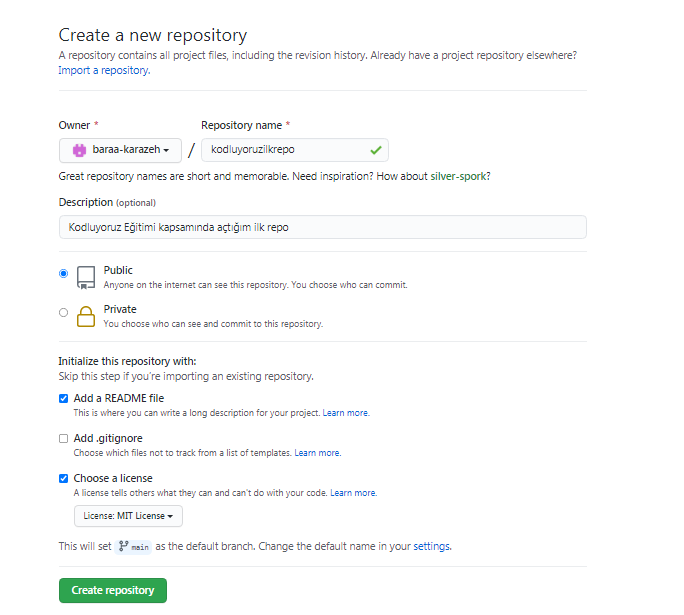

# kodluyoruzilkrepo

Kodluyoruz Eğitimi kapsamında açtığım ilk repo

Bu repo [Kodluyoruzilkrepo](https://github.com/baraa-karazeh/kodluyoruzilkrepo) Front-End Eğitiminde oluşturduğumuz ilk repo. İçerisinde bir adet README dosyası, bir adet de index.html barındırıyor.

# 

## Installation

---

Öncelikle projeyi clonelayın. (Buraya sizin reponuzdan aldığınız link gelecek)

```github
https://github.com/baraa-karazeh/kodluyoruzilkrepo
```

## Usage

---

Projeyi cloneladıktan sonra Visual Studio Code programında açınız.

Linux için:

```github
cd kodluyoruzilkrepo code .
```

## Contributing

---

Pull requestler kabul edilir. Büyük değişiklikler için, lütfen önce neyi değiştirmek istediğinizi tartışmak için bir konu açınız.

## License

---

[MIT](https://choosealicense.com/licenses/mit/)
